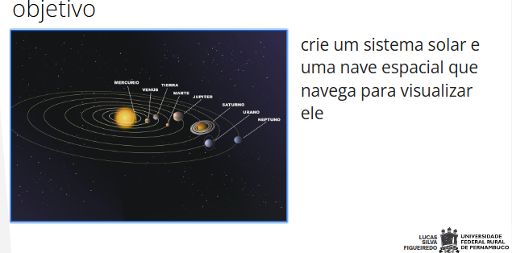

# Miniprojeto 1

Motores Gráficos
2024.2
Miniprojeto 1
Aluno: Christian Oliveira

### Sumário

:o: [Contribuidores](#contribuidores)

:o: [Tecnologias](#tecnologias)

:o: [Especificações](#especificações)

:o: [Link](#link)

:o: [Dicas de acesso](#dicas-de-acesso-arrow_forward)

:o: [Anotações](#anotações)

## Contribuidores

|  |
| ----------------------------------------------------------------------------------------------------------------- |
| [Christian Oliveira](https://github.com/christiandoramo)                                                          |

 

## Tecnologias

 

## Especificações

### Requisitos

:pushpin: **1** - A hierarquia da cena deve corresponder a hierarquia do sistema solar

:pushpin: **2** - As mecânicas de rotação e translação de cada planeta devem funcionar assim que a simulação for iniciada

:pushpin: **3** - Cada planeta e satélite deve ter um elemento além da esfera, anexado a si, para evidenciar o movimento da rotação

:pushpin: **4** - Os satélites devem ser incluídos (3 satélites por planeta já é suficiente)

:pushpin: **5** - Os planetas e luas devem ter materiais diferentes

:pushpin: **6** - A nave deve ser controlada com WASD

### Desafio

:pushpin: **1** - Controlar a direção da nave com o mouse

:pushpin: **2** - Adicionar uma mecânica de aceleração para a nave 

:pushpin: **3** - Criar um “skybox” com as estrelas visíveis

:pushpin: **4** - Todos os componentes devem ser criados em escala

## Link

 

## Dicas de Acesso :arrow_forward:

 

### Anotações

- [x] Criar cada astro: Sol, Mercúrio, Vênus, Terra, Marte, Júpiter, Saturno, Urano, Netuno.
- [x] colocar materiais de cada astro
- [x] criar algoritmo dos astros rotação e adequar variaveis para cada
- [x] criar algoritmo dos astros translação e adequar variaveis para cada
- [x] Criar nave
- [x] Colocar efeito de luz no sol
- [x] criar script completo de movimentação com mouse da nave
- [x] Colocar skybox

 

### Sumário

:o: [Contribuidores](#contribuidores)

:o: [Tecnologias](#tecnologias)

:o: [Especificações](#especificações)

:o: [Link](#link)

:o: [Dicas de acesso](#dicas-de-acesso-arrow_forward)

:o: [Anotações](#anotações)

