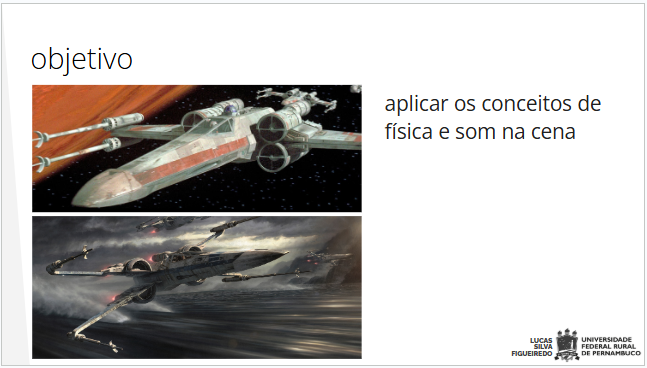
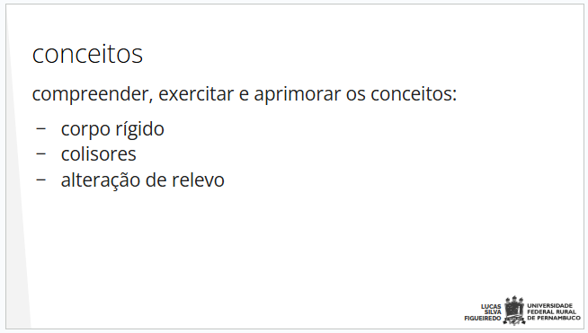
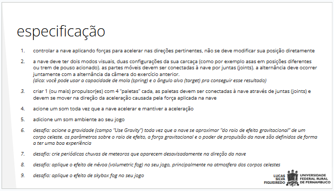

# Miniprojeto 4

Motores Gráficos
2024.2
Mini projeto 4
Aluno: Christian Oliveira

-   [ ] Controlar a nave aplicando forças para acelerar nas direções pertinentes, não se deve modificar sua posição diretamente.

-   [ ] A nave deve ter dois modos visuais, duas configurações da sua carcaça (como, por exemplo, asas em posições diferentes ou trem de pouso acionado). As partes móveis devem ser conectadas à nave por juntas (joints). A alternância deve ocorrer juntamente com a alternância da câmera do exercício anterior. (Dica: você pode usar a capacidade de mola (spring) e o ângulo alvo (target) pra conseguir esse resultado).

-   [ ] Criar 1 (ou mais) propulsor(es) com 4 “paletas” cada. As paletas devem ser conectadas à nave através de juntas (joints) e devem se mover na direção da aceleração causada pela força aplicada na nave.

-   [ ] Acione um som toda vez que a nave acelerar e mantiver a aceleração.

-   [ ] Adicione um som ambiente ao seu jogo.

-   [ ] Desafio: Acione a gravidade (campo “Use Gravity”) toda vez que a nave se aproximar “do raio de efeito gravitacional” de um corpo celeste. Os parâmetros sobre o raio de efeito, a força gravitacional e o poder de propulsão da nave devem ser definidos de forma a proporcionar uma boa experiência.

-   [ ] Desafio: Crie periódicas chuvas de meteoros que aparecem desavisadamente na direção da nave.

-   [ ] Desafio: Aplique o efeito de névoa (volumetric fog) no seu jogo, principalmente na atmosfera dos corpos celestes.

-   [ ] Desafio: Aplique o efeito de skybox fog no seu jogo.

## Tecnologias

 
